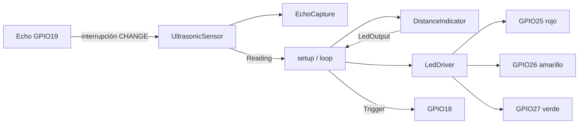
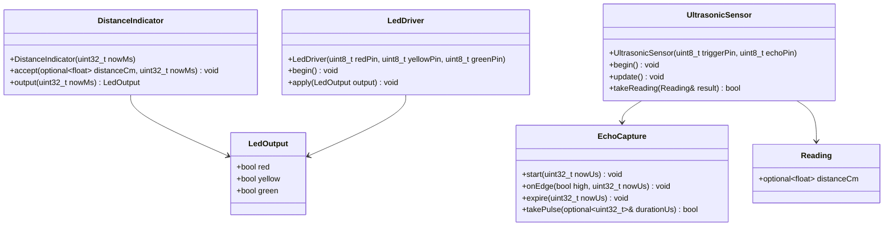
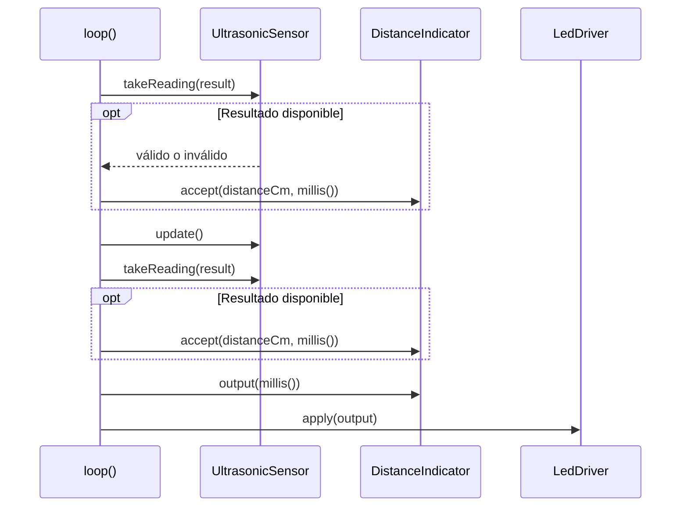
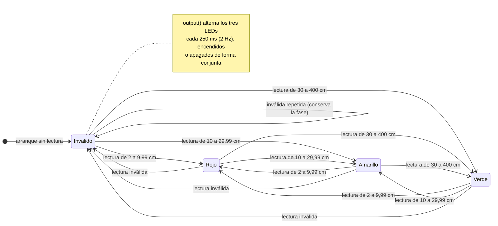
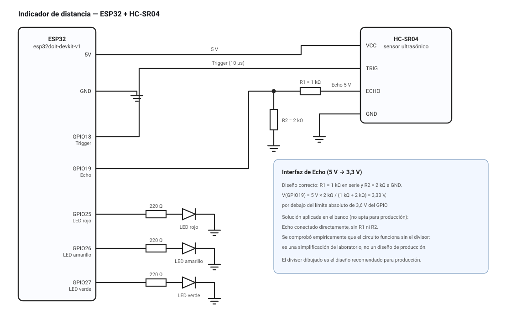

# Informe técnico: indicador de distancia con ESP32

**Práctica 1 (SIS-234) — Integración de sensores y actuadores en un objeto inteligente.** Autor del proyecto: JOSE FRANZ. Creado: 2026-09-07. Actualizado: 2026-09-15. Contexto: práctica educativa.

**Estado:** firmware implementado en C++17, 15 casos Unity aprobados y compilación aprobada para `esp32doit-devkit-v1`. Los ensayos manuales M-01 a M-10 (§5) se ejecutaron y aprobaron el 2026-09-15. La interfaz eléctrica de Echo queda resuelta por diseño con un divisor resistivo; el montaje de laboratorio se ensayó sin ese divisor como solución empírica no apta para producción (§3.3).

## 1. Requerimientos y alcance

El [PRD](_bmad-output/planning-artifacts/prds/prd-indicador-distancia-2026-09-07/prd.md) conserva los requisitos RF-01 a RF-07 y RNF-01 a RNF-06. El sistema clasifica cada lectura válida de 2 a 400 cm: rojo desde 2 hasta menos de 10 cm, amarillo desde 10 hasta menos de 30 cm y verde desde 30 hasta 400 cm. Solo un LED se enciende en esas bandas. Una lectura ausente, no finita o fuera del rango produce un parpadeo conjunto de 250 ms encendido y 250 ms apagado.

El alcance incluye ESP32, sensor ultrasónico de 5 V, tres LEDs, una resistencia de 220 Ω por LED y el divisor resistivo de la interfaz de Echo (§3.3). No incluye conectividad, almacenamiento, filtrado, histéresis ni otras adaptaciones. El software adopta S-01 a S-04; su validez física se comprobó en los ensayos manuales, salvo S-01 (referencia exacta del sensor), que sigue pendiente.

### 1.1 Requerimientos no funcionales declarados

El enunciado (§3.2) exige *declarar* valores medibles y *verificarlos*. Los compromisos adoptados, sus referencias y su forma de verificación son:

| Atributo | Valor declarado | Referencia del enunciado | Cómo se verifica |
|---|---|---|---|
| Estabilidad | ≥ 30 min de operación continua sin reinicios ni bloqueos | ≥ 10 min | M-09 (ensayo continuo con bitácora y video) |
| Exactitud | Error absoluto ≤ 3 cm en todo el rango de 2 a 400 cm | ≤ ±3 cm | M-10 (cinta métrica y puntos de frontera a ±3 cm de los umbrales) |
| Tiempo de respuesta | ≤ 100 ms en el peor caso; objetivo de diseño ≤ 10 ms | ≤ 1 s | M-08 (osciloscopio: bajada de Echo hasta el cambio de salida) |
| Frecuencia de muestreo | 10 lecturas/s (período de 100 ms entre inicios reales) | ≥ 2 lecturas/s | M-07 (separación entre flancos ascendentes de Trigger) |

Los valores declarados son más exigentes que las referencias del enunciado. El período de muestreo de 100 ms y el objetivo de actualización de 10 ms están implementados en el firmware; su cumplimiento físico se acredita con M-07 y M-08.

## 2. Diseño implementado

### 2.1 Adquisición y temporización

`UltrasonicSensor` inicia adquisiciones con separación mínima de 100 000 µs entre inicios reales. Mantiene Trigger alto mediante `delayMicroseconds(10)` y no espera el eco en el bucle. `EchoCapture` recibe flancos desde una interrupción `CHANGE`, exige subida seguida de bajada antes de 30 000 µs y publica exactamente un resultado. La ISR y la tarea protegen la misma captura con `portMUX_TYPE`.

Un pulso válido se convierte mediante `durationUs / 58.0f`. Un timeout o Echo alto al intentar iniciar produce `std::nullopt`. Las diferencias temporales usan resta sin signo para tolerar el desbordamiento de `uint32_t`. El sistema no intenta recuperar ciclos atrasados mediante ráfagas.

### 2.2 Arquitectura de software



| Componente | Firma pública real | Responsabilidad |
|---|---|---|
| `Reading` | `std::optional<float> distanceCm` | Diferencia lectura válida/inválida |
| `DistanceIndicator` | `DistanceIndicator(uint32_t nowMs = 0)`; `accept(optional<float>, uint32_t)`; `output(uint32_t)` | Clasificación, exclusión y fase de parpadeo |
| `EchoCapture` | `start(uint32_t)`; `onEdge(bool, uint32_t)`; `expire(uint32_t)`; `takePulse(optional<uint32_t>&)` | Secuencia temporal y consumo único |
| `UltrasonicSensor` | `UltrasonicSensor(uint8_t, uint8_t)`; `begin()`; `update()`; `takeReading(Reading&)` | GPIO, interrupción, Trigger y conversión |
| `LedDriver` | `LedDriver(uint8_t, uint8_t, uint8_t)`; `begin()`; `apply(LedOutput)` | Escritura activa alta de los tres LEDs |

La [arquitectura detallada](_bmad-output/planning-artifacts/architecture/architecture-indicador-distancia-2026-09-07/ARCHITECTURE-SPINE.md) conserva los contratos AD-1 a AD-6.

### 2.3 Estructura de clases (diagrama estructural)



`Reading` y `LedOutput` son tipos compartidos sin dependencias de Arduino; `UltrasonicSensor` y `LedDriver` son los adaptadores de hardware y `DistanceIndicator` es el núcleo de decisión. Las flechas indican dependencia de compilación, no flujo eléctrico.

### 2.4 Secuencia del bucle



El segundo consumo permite aplicar en la misma iteración un timeout generado por `update()`. `LedDriver::apply` escribe los tres GPIO en cada llamada, apagando primero los que deben quedar bajos.

### 2.5 Diagrama de estados de `DistanceIndicator` (diagrama de comportamiento)



El estado y la fase de parpadeo son responsabilidad exclusiva de `DistanceIndicator` (AD-4). Una lectura inválida es la ausente, la no finita o la que queda fuera de 2 a 400 cm. Las inválidas consecutivas no reinician la fase; la transición válido→inválido sí lo hace y vuelve a empezar con los tres LEDs encendidos.

La [guía del código](GUIA-DEL-CODIGO.md) recorre el flujo completo de ejecución, las partes técnicamente más delicadas —concurrencia entre interrupción y tarea, aritmética de reloj sin signo, protocolo de consumo de resultados— y las construcciones de C++17 que usa el firmware.

## 3. Circuito, configuración y cableado

### 3.1 Diagrama de circuito



La versión autónoma y ampliable del diagrama está en [`circuito/circuito.html`](circuito/circuito.html) (se abre en el navegador) y el vector de origen en `circuito/circuito.svg`. El diagrama incluye los valores de todos los componentes y las conexiones del montaje:

| Origen | Destino | Elemento en serie | Nota |
|---|---|---|---|
| ESP32 5 V | HC-SR04 VCC | — | Alimentación del sensor |
| ESP32 GND | HC-SR04 GND | — | Masa común |
| ESP32 GPIO18 | HC-SR04 TRIG | — | Pulso alto de 10 µs |
| HC-SR04 ECHO | Nodo del divisor | R1 = 1 kΩ | Salida del sensor, ≈5 V |
| Nodo del divisor | ESP32 GPIO19 | — | 3,33 V ≤ 3,6 V |
| Nodo del divisor | GND | R2 = 2 kΩ | Rama inferior del divisor |
| ESP32 GPIO25/26/27 | LED rojo/amarillo/verde → GND | 220 Ω | Ánodo al GPIO, cátodo a masa |

### 3.2 Pinout y cableado

`platformio.ini` fija `espressif32@7.1.1`, Arduino ESP32 `3.20017.241212+sha.dcc1105b`, C++17, `native@1.2.1` y Unity `2.6.1`.

| Función | GPIO | Estado |
|---|---:|---|
| Trigger | 18 | Implementado como salida, inicialmente baja |
| Echo | 19 | Implementado como entrada `CHANGE`; se conecta al nodo del divisor resistivo |
| LED rojo | 25 | Salida activa alta |
| LED amarillo | 26 | Salida activa alta |
| LED verde | 27 | Salida activa alta |

```text
ESP32 GPIO25 ── 220 Ω ── ánodo LED rojo      cátodo ── GND
ESP32 GPIO26 ── 220 Ω ── ánodo LED amarillo  cátodo ── GND
ESP32 GPIO27 ── 220 Ω ── ánodo LED verde     cátodo ── GND

ESP32 GPIO18 ──────────────────────────────── TRIG sensor
sensor ECHO ── R1 1 kΩ ──┬─────────────────── ESP32 GPIO19
                         └── R2 2 kΩ ── GND
ESP32 GND ─────────────────────────────────── GND sensor
5 V verificados de placa ──────────────────── VCC sensor
```

### 3.3 Interfaz eléctrica de Echo: divisor resistivo

Echo puede alcanzar ~5 V y el GPIO del ESP32 tolera como máximo 3,6 V, por lo que la conexión directa no es un diseño seguro. Se autoriza y documenta un divisor resistivo de **R1 = 1 kΩ en serie** y **R2 = 2 kΩ a masa**, que entrega `V(GPIO19) = 5 V × 2 kΩ / (1 kΩ + 2 kΩ) = 3,33 V`, con margen frente a variaciones de la fuente de 5 V. La lista de materiales del Anexo A, el diagrama de circuito, el PRD (P-01) y la arquitectura (AD-6) quedan actualizados con esta solución.

**Solución empírica aplicada en el banco y durante las pruebas.** Los ensayos de la práctica se realizaron **sin** ese divisor: se comprobó empíricamente que el circuito funciona correctamente con Echo conectado directamente al GPIO19, por lo que el montaje de laboratorio usa esa simplificación. Es una solución de banco, no un diseño de producción: no ofrece margen de seguridad frente a variaciones o transitorios del sensor y no debe reproducirse fuera del laboratorio. El divisor descrito es el diseño recomendado para producción y el que debe implementarse en una versión definitiva.

P-01 queda cubierto por el diseño aquí descrito. P-02 exige confirmar placa, alimentación, polaridad y características de los LEDs. Las masas deben ser comunes y nunca se aplican 5 V al pin de 3,3 V.

## 4. Pruebas y validaciones

### 4.1 Cobertura automatizada

La ejecución nativa usa las clases reales y un doble de Arduino para reloj, GPIO, interrupción y secciones críticas. No contiene esperas reales. El inventario completo, los nombres exactos de los 15 casos y la trazabilidad a requisitos están en el [plan integral de pruebas](test/PLAN-DE-PRUEBAS.md).

| Suite | Casos | Resultado del 2026-09-14 |
|---|---:|---|
| `test_indicator` | 5 | Aprobados |
| `test_echo_capture` | 5 | Aprobados |
| `test_sensor` | 4 | Aprobados |
| `test_application` | 1 | Aprobado |
| **Total** | **15** | **15 aprobados** |

La auditoría añadió aserciones dentro de `test_conversion_and_no_overwrite` para comprobar que `begin()` configura GPIO 18 como salida baja, GPIO 19 como entrada, instala `CHANGE` en el pin 19 y que ISR/tarea usan el mismo mutex. El número de casos no cambió.

Evidencia: [`verification-native.txt`](_bmad-output/implementation-artifacts/verification-native.txt) y [`verification-esp32.txt`](_bmad-output/implementation-artifacts/verification-esp32.txt). Ambos registran la huella SHA-256 reproducible de las fuentes verificadas; la evidencia ESP32 registra además el tamaño y SHA-256 de `firmware.bin`.

### 4.2 Entorno, versiones y reproducción

`platformio.ini` fija las versiones y C++17. Estas son las que produjeron la evidencia del 2026-09-14:

| Herramienta | Versión |
|---|---|
| PlatformIO Core observado | 6.2.0 |
| Plataforma Espressif32 fijada | `espressif32@7.1.1` |
| Arduino ESP32 fijado | `3.20017.241212+sha.dcc1105b` |
| Compilador ESP32 observado | Xtensa GCC 8.4.0+2021r2-patch5 |
| Placa declarada | `esp32doit-devkit-v1` |
| Plataforma nativa fijada | `native@1.2.1` |
| Framework de pruebas | Unity `2.6.1` |
| Toolset MSVC nativo (Windows) | `14.44.35207` (Visual Studio 2022) |
| SCons completo para MSVC | `4.11.1` |

Comandos, desde la raíz del repositorio:

```powershell
pio test -e native
pio run -e esp32doit-devkit-v1
git diff --check
```

Si `pio` no está en `PATH`, sirve `platformio` con los mismos argumentos. En Windows se usa Visual Studio 2022 con herramientas C++ x64 y Windows SDK; antes de la primera ejecución hay que preparar los módulos MSVC que la distribución reducida de SCons de PlatformIO omite, con el intérprete de Python que acompaña a PlatformIO:

```powershell
& "$env:USERPROFILE\.platformio\penv\Scripts\python.exe" -m pip install --target .pio/tools/scons scons==4.11.1
```

En Linux/macOS solo se requiere GCC o Clang con C++17 en `PATH`; estas plataformas no se ejecutaron en esta entrega. El entorno nativo compila las clases reales con dobles de GPIO, interrupción y reloj, sin esperas reales.

### 4.3 Alcance de la evidencia

| Nivel | Resultado real | Qué no demuestra |
|---|---|---|
| Revisión documental | Requisitos, AD, firmas, GPIO y pruebas trazados | Comportamiento físico |
| Pruebas de núcleo | Clasificación, fase, captura y desbordamientos aprobados | Precisión acústica o tensión |
| Integración nativa | `setup()`/`loop()` con hardware simulado aprobados | Latencia real de ISR/GPIO |
| Compilación y carga | Firmware construido y cargado en la placa | Compatibilidad con otras revisiones de placa |
| Validación manual | M-01 a M-10 aprobados el 2026-09-15 | Repetibilidad fuera de las condiciones del banco |

## 5. Plan de validación manual

El [plan integral de pruebas](test/PLAN-DE-PRUEBAS.md) define M-01 a M-10 con seguridad, preparación, pasos, resultado esperado, criterio de aprobación y evidencia. El orden obligatorio es:

1. inspeccionar placa, polaridad, resistencias, alimentación y masas;
2. verificar la interfaz de Echo: medir con el divisor de diseño o registrar la solución empírica sin divisor y su justificación;
3. cargar y comprobar arranque/parpadeo;
4. comprobar las tres bandas, recuperación y límites observables;
5. medir Trigger, separación de ciclos, timeout, parpadeo y retraso de salida;
6. ejecutar el ensayo de estabilidad de M-09 (≥ 30 min continuos) y el de exactitud de M-10 (error frente a cinta métrica).

M-09 y M-10 cierran los dos atributos no funcionales que el enunciado exige verificar con valores medibles: estabilidad y exactitud. Los diez casos se ejecutaron y aprobaron el 2026-09-15; el registro está en el Anexo B. Cada caso se aprueba comprobando manualmente que se cumple su criterio, sin exigir fotografías, videos ni capturas.

Los límites físicos por debajo de 2 cm o por encima de 400 cm se interpretan conforme a P-03: el criterio exige que toda lectura reconocida como inválida active el error, pero no promete reconocer todos los ecos espurios.

## 6. Resultados y trazabilidad

| Resultado | Estado | Evidencia |
|---|---|---|
| RF-01 a RF-07 en lógica simulada | Aprobado | 15 casos Unity |
| RNF-01 a RNF-04 | Aprobado por revisión, pruebas y compilación | Código, configuración y salida nativa |
| RNF-05 en diseño y simulación | Aprobado | Casos temporales y de integración |
| RNF-05 en hardware | Aprobado | M-07/M-08 |
| Estabilidad ≥ 30 min continuos | Aprobado | M-09 |
| Exactitud: error absoluto ≤ 3 cm | Aprobado | M-10 |
| RNF-06 compatibilidad eléctrica | Aprobado; el divisor de 1 kΩ y 2 kΩ es el diseño de producción | §3.3 y M-02 |
| AD-1 a AD-5 | Implementados y probados en entorno nativo y en la placa | Suites Unity, compilación y M-01 a M-10 |
| AD-6 | Implementado en software y verificado en el montaje | Código, §3.3 y M-02 |

No se asigna un porcentaje global porque mezclaría evidencia de distinto nivel. El software, la compilación y la validación manual están aprobados; queda abierta la repetibilidad fuera del banco de pruebas.

## 7. Conclusiones

**Cumplimiento de la actividad.** El sistema integra un sensor ultrasónico, tres LEDs y un ESP32 en un objeto inteligente que mide, clasifica y señaliza. Los tres requerimientos funcionales mínimos quedan cubiertos y verificados con 15 pruebas nativas: medición de distancia, tres rangos contiguos sin solapamiento y un comportamiento distinto por rango, además del parpadeo conjunto en condición inválida. Los requerimientos no funcionales se declaran con valores medibles (§1.1) y quedan verificados: los automatizables mediante las 15 pruebas nativas y los físicos mediante los ensayos M-01 a M-10.

**El diseño fue determinante para el resultado.** Separar adquisición, decisión y salida permitió construir y probar el núcleo sin hardware y detectar errores de clasificación y de temporización antes de montar nada. Esa decisión explica que la validación física posterior pudiera ejecutarse sobre un comportamiento ya probado, con 15 casos aprobados y una compilación válida para la placa como punto de partida.

**Estado del entregable.** El repositorio reúne el informe (este documento), el código fuente documentado, los diagramas de arquitectura, circuito, estructura y comportamiento, y los anexos. El firmware está implementado y compila; el prototipo se montó, se cargó en la placa y superó los diez ensayos manuales. El informe mantiene separadas la evidencia automatizada y la comprobación manual, y registra el veredicto de cada caso.

**Límites conocidos.** La tensión de Echo sobre un GPIO de 3,3 V se resuelve por diseño con un divisor; los ensayos usaron la conexión directa y funcionaron, pero esa solución no ofrece margen de seguridad y no es apta para producción. A esto se suma P-03: un eco espurio puede parecer una lectura válida, de modo que la detección de objetos fuera de rango no puede garantizarse solo con software.

**Aprendizaje del proceso.** El trabajo recorrió el ciclo completo de integración hardware-software —requisitos, arquitectura, implementación, pruebas automatizadas y plan de validación con criterios de aceptación— y obligó a coordinar conocimientos de electrónica, programación embebida y documentación técnica. El aprendizaje metodológico principal fue mantener la evidencia separada por nivel (documental, nativa, de compilación y manual) en lugar de resumirla en una única afirmación de cumplimiento.

**Minimo de distancia.** Las pruebas con objetos a menos de 2 [cm] de distancia del sensor HRC-04 presentan fallas de rebote por parte del mismo sensor, ocasionando lecturas irreales de la distancia a la que los objetos son dispuestos. 

## 8. Recomendaciones

**Diseño y hardware**

- Implementar el divisor R1 = 1 kΩ / R2 = 2 kΩ en cualquier versión fuera del laboratorio; la conexión directa al GPIO solo es aceptable como verificación de banco.
- Verificar la tolerancia de las resistencias y mantener margen del divisor frente a la tolerancia de la fuente de 5 V.
- Confirmar la referencia real del sensor (S-01) y su rango antes de cerrar la geometría del montaje.
- Mantener masas comunes, no alimentar el sensor desde el pin de 3,3 V y proteger el GPIO frente a transitorios.

**Firmware y robustez**

- Añadir histéresis en los umbrales de 10 cm y 30 cm para evitar el parpadeo en las fronteras.
- Filtrar por mediana un número reducido de lecturas para descartar ecos espurios, acotando el tamaño de la ventana para no superar el tiempo de respuesta declarado.
- Calibrar el factor de 58 µs/cm contra una referencia física.
- Exponer la distancia medida por `Serial` como modo de diagnóstico: habilita la ejecución de M-10 y no amplía el alcance funcional.
- Conservar la captura por interrupción en lugar de `pulseIn` con timeout.

**Pruebas y validación**

- Repetir la campaña M-01 a M-10 tras cualquier cambio de hardware o firmware y registrar el nuevo veredicto.
- Repetir la serie de exactitud al menos dos veces para estimar la repetibilidad, no solo el error puntual.
- Registrar la temperatura del ensayo o documentar su influencia, ya que la velocidad del sonido depende de ella.
- Automatizar las pruebas nativas en cada cambio para evitar regresiones.

**Documentación y proceso**

- Mantener este README como informe único y sincronizarlo con el código y la evidencia en cada cambio.
- Incorporar al informe la tabla de integrantes y su aporte individual verificable.
- Etiquetar la entrega con la versión de firmware ensayada, para que los resultados citados sean reproducibles.
- Mantener actualizado el registro de ensayos del Anexo B con el veredicto de cada caso.

**Proyección**

- Explorar un montaje soldado o en PCB con conectores para reducir ruido y falsos contactos.
- Evaluar sensores alternativos si el proyecto necesita otro rango o condiciones ambientales distintas.
- Considerar una salida de usuario más rica (pantalla o registro local) como evolución natural del indicador.

## 9. Anexos

### A. Materiales autorizados

| Elemento | Cantidad |
|---|---:|
| Placa ESP32 | 1 |
| Sensor ultrasónico de 5 V | 1 |
| LED rojo | 1 |
| LED amarillo | 1 |
| LED verde | 1 |
| Resistencia de 220 Ω | 3, una por LED |
| Resistencia de 1 kΩ | 1, R1 del divisor de Echo (§3.3) |
| Resistencia de 2 kΩ | 1, R2 del divisor de Echo (§3.3) |

### B. Registro resumido de ensayo físico

| Fecha | Caso | Resultado observado | Veredicto |
|---|---|---|---|
| 2026-09-15 | M-01 | Inspección de placa, LEDs, resistencias y masas conforme al esquema | Aprobado |
| 2026-09-15 | M-02 | Interfaz de Echo dentro del límite del GPIO en el montaje de banco | Aprobado |
| 2026-09-15 | M-03 | Carga, arranque en condición inválida y parpadeo conjunto correctos | Aprobado |
| 2026-09-15 | M-04 | Un solo LED del color esperado en las nueve repeticiones | Aprobado |
| 2026-09-15 | M-05 | Parpadeo y recuperación del amarillo dentro del plazo | Aprobado |
| 2026-09-15 | M-06 | Condiciones fuera de rango con parpadeo conjunto (P-03) | Aprobado |
| 2026-09-15 | M-07 | Trigger, separación entre inicios y ventana de timeout conformes | Aprobado |
| 2026-09-15 | M-08 | Medias fases, período y retraso de salida conformes | Aprobado |
| 2026-09-15 | M-09 | Operación continua sin reinicios ni bloqueos | Aprobado |
| 2026-09-15 | M-10 | Puntos de frontera en la banda esperada; error absoluto ≤ 3 cm | Aprobado |

Los ensayos se ejecutaron sobre el firmware verificado el 2026-09-14. El procedimiento y el criterio de aprobación de cada caso están en el [plan integral de pruebas](test/PLAN-DE-PRUEBAS.md).

### C. Referencias

1. [Ficha técnica HC-SR04 de ElecFreaks, alojada por SparkFun](https://cdn.sparkfun.com/datasheets/Sensors/Proximity/HCSR04.pdf).
2. [Espressif: tolerancia de GPIO](https://docs.espressif.com/projects/esp-faq/en/latest/hardware-related/hardware-design.html#what-is-the-voltage-tolerance-of-gpios-of-esp-chips).
3. `platformio.ini`, `include/`, `src/` y `test/`, inspeccionados y verificados el 2026-09-14.
