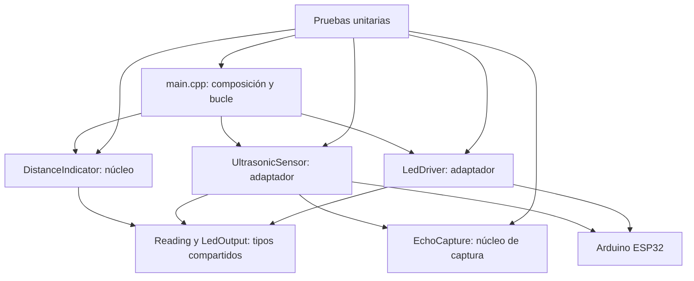
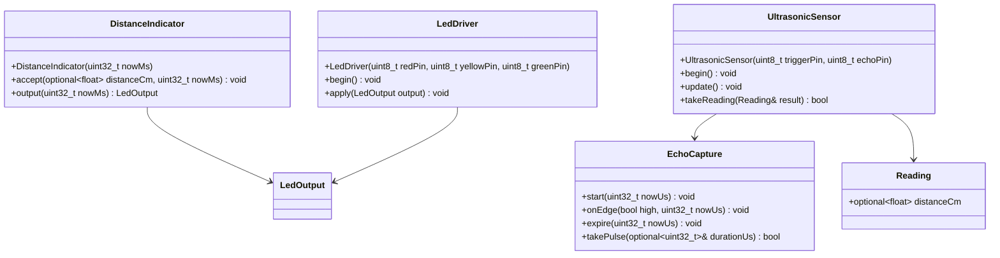
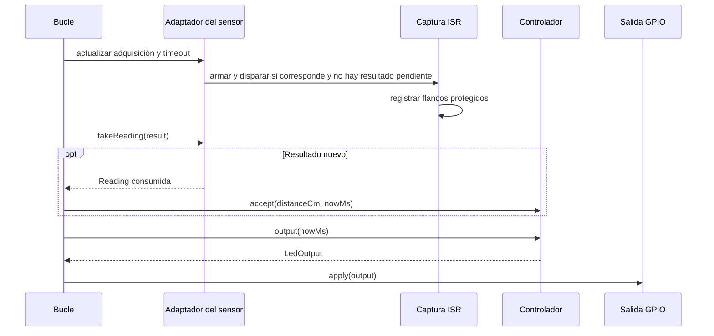

# Arquitectura: indicador de distancia con ESP32

Arquitectura implementada para la práctica educativa de JOSE FRANZ. El firmware compila para ESP32 y sus 15 casos Unity están aprobados. P-01 quedó resuelto por diseño con el divisor resistivo de Echo (AD-6), P-02 se confirmó durante la validación y P-03 mantiene su límite de interpretación. La integración física se verificó con los ensayos M-01 a M-10 del [plan integral](../../../../test/PLAN-DE-PRUEBAS.md).

## Paradigma y dependencias

Núcleo funcional orientado a objetos, con estado encapsulado y entradas explícitas de tiempo y medición; adaptadores concretos para adquisición y GPIO. Sin contenedor de dependencias ni jerarquías de clases innecesarias.



Las flechas son dependencias permitidas, no flujo eléctrico. Los núcleos y tipos compartidos no incluyen Arduino ni llaman GPIO o relojes reales.

## Invariantes y reglas

Los campos **Binds**, **Prevents** y **Rule** indican respectivamente qué vincula cada decisión, qué incompatibilidad evita y la regla exigible. `[IMPLEMENTADO]` identifica comportamiento presente en el firmware; las referencias a S-01–S-04 conservan los supuestos; sus magnitudes físicas se comprobaron en los ensayos manuales, salvo S-01, que sigue pendiente.

### AD-1 — Separación de responsabilidades

- **Binds:** RF-01 a RF-07; RNF-01 a RNF-03.
- **Prevents:** lógica de colores duplicada en GPIO o adquisición, y pruebas dependientes del ESP32.
- **Rule:** [IMPLEMENTADO] C++ orientado a objetos, código y comentarios en inglés, documentación en español; comentarios solo si aclaran intención no evidente. `main.cpp` compone objetos de vida estática y coordina; `UltrasonicSensor` produce lecturas; `DistanceIndicator` es único dueño de color y fase; `LedDriver` aplica salidas sin reinterpretarlas. `EchoCapture` valida secuencias temporales dentro del adaptador y se prueba sin hardware.

### AD-2 — Contrato de lectura y unidades

- **Binds:** adquisición, controlador y sus pruebas; RF-01, RF-06.
- **Prevents:** confundir falta de novedades con timeout, reutilizar ecos o mezclar microsegundos con milisegundos.
- **Rule:** [IMPLEMENTADO] compartir `Reading` con un campo `std::optional<float> distanceCm`. `bool takeReading(Reading& result)` devuelve `false` sin modificar `result` si no existe resultado nuevo; devuelve `true` y consume exactamente un resultado si existe. `distanceCm == std::nullopt` significa medición inválida/timeout. Un pulso completo se convierte una sola vez mediante `durationUs / 58.0f`; no redondear antes de clasificar. El controlador rechaza también no finitos y valores fuera del rango. El bucle consume antes de iniciar otra adquisición; no se sobrescribe un resultado pendiente. Tiempos `std::uint32_t` con sufijos `Us`/`Ms`; calcular diferencias mediante resta sin signo y atender cada reloj antes de completar una vuelta de su contador.

### AD-3 — Adquisición sin esperas largas

- **Binds:** `UltrasonicSensor`, `EchoCapture`, bucle y pruebas; RNF-05.
- **Prevents:** perder pulsos breves por sondeo lento, carreras entre ISR y bucle, y detener el parpadeo durante un timeout.
- **Rule:** [IMPLEMENTADO; S-04 verificado en M-07/M-08] iniciar como máximo una adquisición cada 100 ms medidos entre inicios reales; sin ráfagas para recuperar ciclos atrasados. Mantener Trigger bajo inicialmente y emitir un pulso alto de al menos 10 µs; solo se admite esa breve espera de disparo, nunca `pulseIn` ni esperas del eco en el bucle.
  Capturar flancos con `attachInterruptArg` en modo `CHANGE`. La ISR solo registra nivel y marca temporal y avanza la captura; no convierte distancias, asigna memoria ni modifica LEDs. Estado compartido protegido con sección crítica compatible ISR/tarea del ESP32; `volatile` por sí solo no es sincronización. Copiar y consumir el resultado en el bucle bajo la misma protección.
  Un ciclo espera subida y luego bajada. La fecha límite de ambos flancos es 30 000 µs desde la subida de Trigger. Aceptar una pareja ordenada completada antes del límite; a igualdad o después producir una sola lectura inválida. Resolver la carrera por marcas temporales, no por el orden en que el bucle observa el resultado. Ignorar flancos fuera de ciclo y descartar captura parcial al vencer el plazo. Si Echo ya está alto al iniciar, publicar inválida sin disparar y esperar al siguiente período. Un flanco tardío indistinguible dentro de una adquisición nueva sigue sujeto al límite físico P-03.

  El adaptador difiere cualquier disparo mientras exista un resultado pendiente; una iteración adicional después del consumo es válida. Inicio: bajo protección, comprobar Echo bajo, limpiar captura previa, registrar el origen temporal, elevar Trigger y armar el ciclo antes de liberar la protección. Mantener el pulso mínimo fuera de la sección crítica y después bajar Trigger. Ignorar registros anteriores al origen del ciclo. Las marcas de flanco representan atención de ISR, no tiempo físico exacto; su latencia se verificó en M-07/M-08.
  Contrato mínimo de `EchoCapture`: `start(std::uint32_t nowUs)`, `onEdge(bool high, std::uint32_t nowUs)`, `expire(std::uint32_t nowUs)` y `bool takePulse(std::optional<std::uint32_t>& durationUs)`. `start` solo se llama en reposo sin resultado pendiente; `takePulse` usa el mismo protocolo de consumo de AD-2, con ausencia de duración para inválida. La captura posee estado y marcas; el adaptador protege todas estas operaciones. `expire` conserva un pulso ya completado dentro del plazo, aunque el bucle lo observe después.

### AD-4 — Estado y temporización de LEDs

- **Binds:** `DistanceIndicator`, `LedDriver`; RF-02 a RF-07.
- **Prevents:** umbrales distintos por LED, reinicio permanente del parpadeo o fase dependiente de la duración de Echo.
- **Rule:** [IMPLEMENTADO] para una lectura válida: menor de 10 cm rojo; desde 10 hasta menos de 30 amarillo; desde 30 verde. Solo uno encendido. El rango implementado es inclusivo de 2 a 400 cm según S-01; toda lectura inválida tiene prioridad. Según S-02/S-03, el arranque y el timeout son inválidos; la fase comienza con los tres encendidos al iniciar y en cada transición válida→inválida, y alterna cada 250 ms sin reiniciarse por otra inválida. Al recuperarse, aplica el color en la misma iteración que consume la lectura. Saltos del reloj conservan fase según medias fases transcurridas, sin reproducir transiciones atrasadas. `LedOutput` contiene tres booleanos `red`, `yellow`, `green`; `true` significa LED encendido, y el adaptador activo alto escribe los tres GPIO en cada aplicación. El bucle actualiza salidas en cada iteración; el objetivo de retraso máximo de 10 ms se verificó en M-08.

### AD-5 — Verificación independiente del montaje

- **Binds:** núcleo, captura, integración y RNF-04.
- **Prevents:** aceptar resultados físicos a partir de pruebas simuladas o probar una copia del algoritmo.
- **Rule:** [IMPLEMENTADO] pruebas unitarias sobre las mismas clases del firmware en PlatformIO y Unity, con reloj y flancos inyectados mediante un doble de Arduino. Cubren 1,99/2/9,99/10/29,99/30/400/400,01 cm, ausencia, negativos, NaN e infinito; exclusión, arranque, recuperación, inválidas sucesivas, marcas 249/250/499/500 ms y desbordamiento. Para captura cubren flancos sin subida, orden correcto, límite de timeout, Echo alto inicial, ecos tardíos, consumo único y ausencia de novedades. La compilación ESP32 también está aprobada y las pruebas físicas de GPIO y tiempos se ejecutaron en M-07/M-08.

  Incluir además saltos de varias medias fases y conversión de un pulso conocido (por ejemplo, 580 µs a 10 cm), cubriendo PU-08 y PU-09 del informe.

### AD-6 — Alcance eléctrico y despliegue

- **Binds:** todos los componentes y RNF-06.
- **Prevents:** añadir hardware sin autorización o considerar que la alimentación de la placa hace tolerantes sus GPIO a 5 V.
- **Rule:** [IMPLEMENTADO EN SOFTWARE] ESP32, sensor de 5 V, tres LEDs, una resistencia de 220 Ω por LED y el divisor resistivo de la interfaz de Echo: R1 = 1 kΩ en serie y R2 = 2 kΩ a masa, que entrega 3,33 V frente al límite absoluto de 3,6 V. Sin conectividad ni funciones adicionales. El firmware asigna Trigger 18, Echo 19, rojo 25, amarillo 26 y verde 27; Echo se conecta al nodo del divisor, nunca directamente a la salida de 5 V del sensor. La conexión directa sin divisor se ejecutó solo como comprobación empírica de banco y no es un diseño válido para producción ni para uso continuo. No agregar otras adaptaciones ni sustituir el sensor. Desarrollo y pruebas unitarias en ordenador; carga local de PlatformIO verificada en M-03. Sin backend, almacenamiento ni actualización remota. Reiniciar no conserva estado y vuelve a la fase inicial de AD-4. Validación física ejecutada y aprobada (M-01 a M-10).

## Interfaces implementadas



## Base tecnológica verificada

`platformio.ini` fija las siguientes versiones y C++17. La ejecución aprobada se conserva en los archivos de evidencia de implementación.

| Elemento | Versión o evidencia |
|---|---|
| C++ | C++17 configurado y compilado |
| Plataforma Espressif32 | `espressif32@7.1.1` fijada y compilada |
| Arduino ESP32, paquete PlatformIO | `3.20017.241212+sha.dcc1105b` fijado |
| Placa | `esp32doit-devkit-v1`, declarada en configuración local |
| Pruebas | `native@1.2.1`, Unity `2.6.1`, 15 casos aprobados |

La [publicación 7.1.1](https://github.com/platformio/platform-espressif32/releases/tag/v7.1.1) confirma la versión de plataforma observada; la [documentación de la placa](https://docs.platformio.org/en/latest/boards/espressif32/esp32doit-devkit-v1.html) confirma su identificador. [Unity admite pruebas nativas y embebidas](https://docs.platformio.org/en/stable/advanced/unit-testing/frameworks/unity.html). La captura GPIO usa una [API de interrupciones documentada](https://docs.espressif.com/projects/arduino-esp32/en/latest/api/gpio.html); `attachInterruptArg` se verificó también en el encabezado local instalado. No se asume equivalencia entre ejemplos de la última documentación y el núcleo instalado.

## Estructura implementada y flujo

```text
include/
  Reading.h
  LedOutput.h
  DistanceIndicator.h
  EchoCapture.h
  UltrasonicSensor.h
  LedDriver.h
src/
  main.cpp
  UltrasonicSensor.cpp
  LedDriver.cpp
test/
  test_indicator/
  test_echo_capture/
  test_sensor/
  test_application/
  support/Arduino.h
```



## Cobertura

| Requisitos | Responsable | Decisiones |
|---|---|---|
| RF-01 y RF-06 | Adquisición y consumo | AD-2, AD-3 |
| RF-02 a RF-05 y RF-07 | Controlador y salida | AD-4 |
| RNF-01 a RNF-03 | Estructura y composición | AD-1 |
| RNF-04 | Pruebas | AD-5 |
| RNF-05 | Captura y bucle | AD-3, AD-4 |
| RNF-06 | Cableado y despliegue | AD-6 |

## Pendientes y decisiones diferidas

- **P-01 resuelto por diseño; P-02 verificado en M-01:** la interfaz de Echo se resuelve con el divisor R1 = 1 kΩ / R2 = 2 kΩ de AD-6, que entrega 3,33 V frente al límite de 3,6 V. El montaje de laboratorio se ensayó sin el divisor por comprobación empírica; esa solución de banco no debe reproducirse en producción. La placa, la polaridad de los LEDs y los niveles de Echo quedaron confirmados durante M-01/M-02; la referencia exacta del sensor (S-01) sigue pendiente de confirmar. [Límite GPIO de Espressif](https://docs.espressif.com/projects/esp-faq/en/latest/hardware-related/hardware-design.html#what-is-the-voltage-tolerance-of-gpios-of-esp-chips).
- **Aceptación P-03:** confirmar que la indicación de error opera sobre mediciones inválidas detectadas; no prometer detección de todo objeto físicamente fuera de rango. El rango y conversión asumidos provienen de la [ficha HC-SR04](https://cdn.sparkfun.com/datasheets/Sensors/Proximity/HCSR04.pdf).
- **Supuestos S-01 a S-04:** adoptados para el comportamiento del software y verificados con simulación; sus magnitudes físicas se comprobaron en los ensayos manuales, salvo S-01 (referencia exacta del sensor), que sigue pendiente.
- **Implementación:** C++17, dependencias, sección crítica y contratos están implementados y cubiertos por pruebas nativas. La latencia de ISR, la precisión acústica y los tiempos de GPIO se verificaron en M-07/M-08 del [plan integral](../../../../test/PLAN-DE-PRUEBAS.md).
- **Evaluación educativa:** PRD, informe, arquitectura y plan están sincronizados con el código y la evidencia del 2026-09-14.

La arquitectura está implementada en software y el diseño eléctrico de la interfaz de Echo queda definido con el divisor. La integración física se verificó con los ensayos M-01 a M-10 y P-03 sigue limitando la interpretación de distancias fuera de rango.
