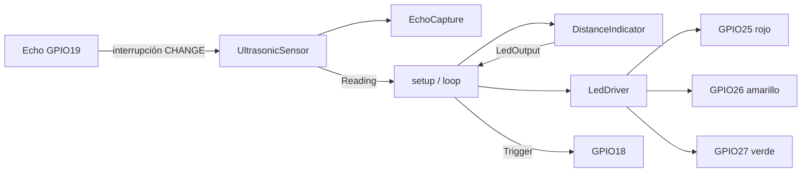
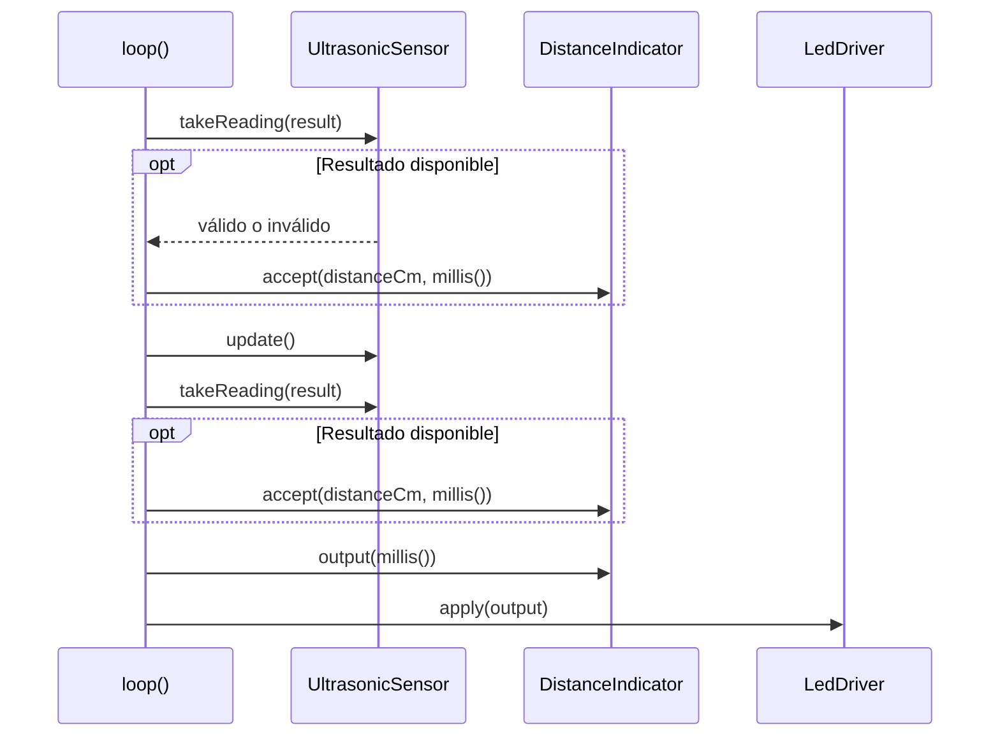

# Informe técnico: indicador de distancia con ESP32

Autor del proyecto: JOSE FRANZ. Creado: 2026-09-07. Actualizado: 2026-09-14. Contexto: práctica educativa.

**Estado:** firmware implementado en C++17, 15 casos Unity aprobados y compilación aprobada para `esp32doit-devkit-v1`. No se cargó firmware ni se realizaron mediciones físicas. Echo no debe conectarse al GPIO 19 hasta demostrar que su tensión máxima no supera 3,6 V.

## 1. Requerimientos y alcance

El [PRD](prd.md) conserva los requisitos RF-01 a RF-07 y RNF-01 a RNF-06. El sistema clasifica cada lectura válida de 2 a 400 cm: rojo desde 2 hasta menos de 10 cm, amarillo desde 10 hasta menos de 30 cm y verde desde 30 hasta 400 cm. Solo un LED se enciende en esas bandas. Una lectura ausente, no finita o fuera del rango produce un parpadeo conjunto de 250 ms encendido y 250 ms apagado.

El alcance incluye ESP32, sensor ultrasónico de 5 V, tres LEDs y una resistencia de 220 Ω por LED. No incluye conectividad, almacenamiento, filtrado, histéresis ni hardware de adaptación añadido. El software adopta S-01 a S-04; su validez física sigue pendiente.

## 2. Diseño implementado

### 2.1 Adquisición y temporización

`UltrasonicSensor` inicia adquisiciones con separación mínima de 100 000 µs entre inicios reales. Mantiene Trigger alto mediante `delayMicroseconds(10)` y no espera el eco en el bucle. `EchoCapture` recibe flancos desde una interrupción `CHANGE`, exige subida seguida de bajada antes de 30 000 µs y publica exactamente un resultado. La ISR y la tarea protegen la misma captura con `portMUX_TYPE`.

Un pulso válido se convierte mediante `durationUs / 58.0f`. Un timeout o Echo alto al intentar iniciar produce `std::nullopt`. Las diferencias temporales usan resta sin signo para tolerar el desbordamiento de `uint32_t`. El sistema no intenta recuperar ciclos atrasados mediante ráfagas.

### 2.2 Arquitectura de software



| Componente | Firma pública real | Responsabilidad |
|---|---|---|
| `Reading` | `std::optional<float> distanceCm` | Diferencia lectura válida/inválida |
| `DistanceIndicator` | `DistanceIndicator(uint32_t nowMs = 0)`; `accept(optional<float>, uint32_t)`; `output(uint32_t)` | Clasificación, exclusión y fase de parpadeo |
| `EchoCapture` | `start(uint32_t)`; `onEdge(bool, uint32_t)`; `expire(uint32_t)`; `takePulse(optional<uint32_t>&)` | Secuencia temporal y consumo único |
| `UltrasonicSensor` | `UltrasonicSensor(uint8_t, uint8_t)`; `begin()`; `update()`; `takeReading(Reading&)` | GPIO, interrupción, Trigger y conversión |
| `LedDriver` | `LedDriver(uint8_t, uint8_t, uint8_t)`; `begin()`; `apply(LedOutput)` | Escritura activa alta de los tres LEDs |

La [arquitectura detallada](../../architecture/architecture-indicador-distancia-2026-09-07/ARCHITECTURE-SPINE.md) conserva los contratos AD-1 a AD-6.

### 2.3 Secuencia del bucle



El segundo consumo permite aplicar en la misma iteración un timeout generado por `update()`. `LedDriver::apply` escribe los tres GPIO en cada llamada, apagando primero los que deben quedar bajos.

## 3. Configuración y cableado condicionado

`platformio.ini` fija `espressif32@7.1.1`, Arduino ESP32 `3.20017.241212+sha.dcc1105b`, C++17, `native@1.2.1` y Unity `2.6.1`.

| Función | GPIO | Estado |
|---|---:|---|
| Trigger | 18 | Implementado como salida, inicialmente baja |
| Echo | 19 | Implementado como entrada `CHANGE`; conexión física bloqueada por P-01 |
| LED rojo | 25 | Salida activa alta |
| LED amarillo | 26 | Salida activa alta |
| LED verde | 27 | Salida activa alta |

```text
ESP32 GPIO25 ── 220 Ω ── ánodo LED rojo      cátodo ── GND
ESP32 GPIO26 ── 220 Ω ── ánodo LED amarillo  cátodo ── GND
ESP32 GPIO27 ── 220 Ω ── ánodo LED verde     cátodo ── GND

ESP32 GPIO18 ──────────────────────────────── TRIG sensor
ESP32 GPIO19       SIN CONEXIÓN              ECHO sensor
ESP32 GND ─────────────────────────────────── GND sensor
5 V verificados de placa ──────────────────── VCC sensor
```

P-01 exige medir Echo con GPIO 19 desconectado. Solo se autoriza la conexión si el máximo observado es `≤3,6 V`. P-02 exige confirmar placa, alimentación, polaridad y características de los LEDs. Las masas deben ser comunes y nunca se aplican 5 V al pin de 3,3 V.

## 4. Pruebas ejecutadas

### 4.1 Cobertura automatizada

La ejecución nativa usa las clases reales y un doble de Arduino para reloj, GPIO, interrupción y secciones críticas. No contiene esperas reales. El inventario completo, los nombres exactos de los 15 casos y la trazabilidad a requisitos están en el [plan integral de pruebas](../../../../PLAN-DE-PRUEBAS.md).

| Suite | Casos | Resultado del 2026-09-14 |
|---|---:|---|
| `test_indicator` | 5 | Aprobados |
| `test_echo_capture` | 5 | Aprobados |
| `test_sensor` | 4 | Aprobados |
| `test_application` | 1 | Aprobado |
| **Total** | **15** | **15 aprobados** |

La auditoría añadió aserciones dentro de `test_conversion_and_no_overwrite` para comprobar que `begin()` configura GPIO 18 como salida baja, GPIO 19 como entrada, instala `CHANGE` en el pin 19 y que ISR/tarea usan el mismo mutex. El número de casos no cambió.

Comandos ejecutados:

```powershell
pio test -e native
pio run -e esp32doit-devkit-v1
git diff --check
```

`platformio` admite los mismos argumentos. La ruta absoluta conservada en los archivos de evidencia identifica el ejecutable local realmente utilizado.

Evidencia: [`verification-native.txt`](../../../implementation-artifacts/verification-native.txt) y [`verification-esp32.txt`](../../../implementation-artifacts/verification-esp32.txt). Ambos registran la huella SHA-256 reproducible de las fuentes verificadas; la evidencia ESP32 registra además el tamaño y SHA-256 de `firmware.bin`.

### 4.2 Alcance de la evidencia

| Nivel | Resultado real | Qué no demuestra |
|---|---|---|
| Revisión documental | Requisitos, AD, firmas, GPIO y pruebas trazados | Comportamiento físico |
| Pruebas de núcleo | Clasificación, fase, captura y desbordamientos aprobados | Precisión acústica o tensión |
| Integración nativa | `setup()`/`loop()` con hardware simulado aprobados | Latencia real de ISR/GPIO |
| Compilación ESP32 | Firmware construido correctamente | Carga o funcionamiento en placa |
| Validación manual | No ejecutada | Montaje, seguridad eléctrica, bandas y tiempos físicos |

## 5. Plan de validación manual

El [PLAN-DE-PRUEBAS.md](../../../../PLAN-DE-PRUEBAS.md) define M-01 a M-08 con seguridad, preparación, pasos, resultado esperado, criterio de aprobación y evidencia. El orden obligatorio es:

1. inspeccionar placa, polaridad, resistencias, alimentación y masas con Echo desconectado;
2. medir Echo sin conectarlo al GPIO y bloquear la continuación si supera 3,6 V;
3. cargar y comprobar arranque/parpadeo;
4. comprobar las tres bandas, recuperación y límites observables;
5. medir Trigger, separación de ciclos, timeout, parpadeo y retraso de salida.

Los límites físicos por debajo de 2 cm o por encima de 400 cm se interpretan conforme a P-03: el criterio exige que toda lectura reconocida como inválida active el error, pero no promete reconocer todos los ecos espurios.

## 6. Resultados y trazabilidad

| Resultado | Estado | Evidencia |
|---|---|---|
| RF-01 a RF-07 en lógica simulada | Aprobado | 15 casos Unity |
| RNF-01 a RNF-04 | Aprobado por revisión, pruebas y compilación | Código, configuración y salida nativa |
| RNF-05 en diseño y simulación | Aprobado | Casos temporales y de integración |
| RNF-05 en hardware | Pendiente | M-07/M-08 |
| RNF-06 compatibilidad eléctrica | Pendiente bloqueante | M-01/M-02 |
| AD-1 a AD-5 | Implementados y probados en entorno nativo | Suites Unity y compilación |
| AD-6 | Implementado en asignación de software; montaje pendiente | Código y M-01/M-02 pendiente |

No se asigna un porcentaje global porque mezclaría evidencia de distinto nivel. El software y la compilación están aprobados; la aceptación física del producto sigue abierta.

## 7. Conclusiones

El repositorio ya contiene el firmware completo, sus adaptadores de Arduino, un núcleo comprobable y una integración nativa. La matriz automatizada cubre umbrales, exclusión, errores, recuperación, fase, desbordamiento, orden de flancos, timeout, consumo único, GPIO, período y composición de la aplicación.

El riesgo principal continúa siendo eléctrico: una señal Echo superior a 3,6 V no puede conectarse directamente al ESP32. Después de cerrar P-01/P-02, los casos manuales permitirán decidir el cumplimiento físico sin inferir tolerancias ni pasos. Hasta entonces no corresponde declarar montaje funcional, precisión acústica ni tiempos medidos.

## 8. Anexos

### A. Materiales autorizados

| Elemento | Cantidad |
|---|---:|
| Placa ESP32 | 1 |
| Sensor ultrasónico de 5 V | 1 |
| LED rojo | 1 |
| LED amarillo | 1 |
| LED verde | 1 |
| Resistencia de 220 Ω | 3, una por LED |

### B. Registro resumido de ensayo físico

| Fecha | Caso | Entrada/condición | Instrumento | Resultado observado | Evidencia | Veredicto |
|---|---|---|---|---|---|---|
| Pendiente | M-01 a M-08 | Pendiente | Pendiente | Pendiente | Pendiente | No ejecutado |

### C. Referencias

1. [Ficha técnica HC-SR04 de ElecFreaks, alojada por SparkFun](https://cdn.sparkfun.com/datasheets/Sensors/Proximity/HCSR04.pdf).
2. [Espressif: tolerancia de GPIO](https://docs.espressif.com/projects/esp-faq/en/latest/hardware-related/hardware-design.html#what-is-the-voltage-tolerance-of-gpios-of-esp-chips).
3. `platformio.ini`, `include/`, `src/` y `test/`, inspeccionados y verificados el 2026-09-14.
