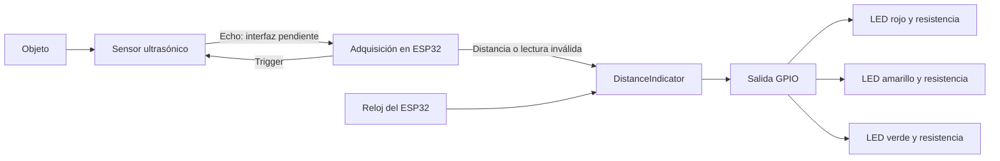
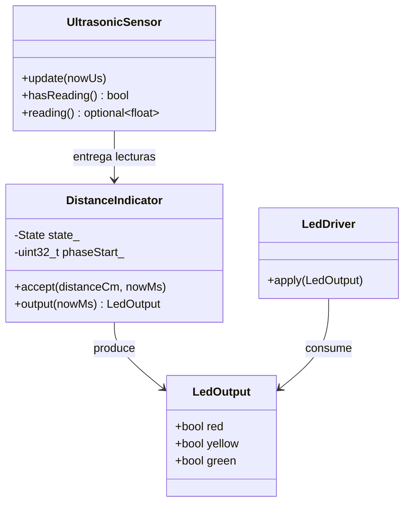
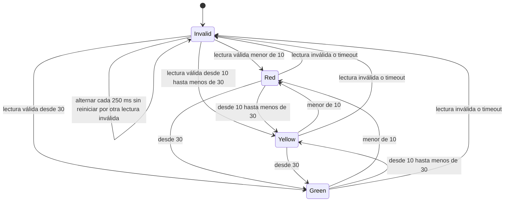

# Informe técnico: indicador de distancia con ESP32

Autor del proyecto: JOSE FRANZ. Fecha: 2026-09-07. Contexto: práctica educativa.

**Estado:** diseño documental y código de referencia del núcleo lógico. No se ha implementado ni ejecutado el firmware completo. No se han realizado mediciones físicas. El cierre eléctrico depende de verificar Echo sin ampliar los componentes autorizados.

## 1. Requerimientos funcionales y no funcionales

El [PRD](prd.md) contiene los requisitos RF-01 a RF-07 y RNF-01 a RNF-06, sus criterios de aceptación y supuestos. El sistema utiliza un solo LED para las distancias válidas: rojo por debajo de 10 cm, amarillo desde 10 hasta menos de 30 cm y verde desde 30 cm. Una lectura inválida activa el parpadeo simultáneo de los tres LEDs a 2 Hz.

Se exige programación orientada a objetos en C++ moderno, código en inglés, documentación en español y pruebas unitarias. El alcance no incluye conectividad ni funciones adicionales.

## 2. Análisis y diseño

### 2.1 Medición y límites

Para el HC-SR04 convencional se adopta provisionalmente el intervalo nominal de 2 a 400 cm. El módulo recibe un pulso Trigger de al menos 10 µs; la duración de Echo permite estimar la distancia mediante `distanceCm = echoDurationUs / 58.0`. La ficha recomienda separar las mediciones más de 60 ms. Se propone un período de 100 ms. Estos datos proceden de la [ficha del sensor](https://cdn.sparkfun.com/datasheets/Sensors/Proximity/HCSR04.pdf).

El tiempo máximo propuesto de 30 ms es una decisión de implementación, superior a los 23 200 µs correspondientes a 400 cm con esa conversión. Un timeout representa ausencia de medición válida, no una distancia de cero. La adquisición debe ser una máquina de estados o capturar flancos para no detener durante 30 ms la actualización de LEDs.

El software no puede demostrar que un objeto se encuentra dentro del rango solo porque obtiene un pulso aparentemente válido. Superficies, orientación y ecos pueden afectar la medida; especialmente por debajo del mínimo, no se garantiza reconocer todos los casos físicamente fuera de rango.

### 2.2 Arquitectura del sistema



Todos los bloques de software se ejecutan en el ESP32. El reloj representa un recurso interno, no un componente adicional.

### 2.3 Diagrama de circuito

Esquema parcial propuesto, **no apto para montaje completo** mientras Echo esté pendiente. Los GPIO son asignaciones propuestas para la placa configurada, no cableado verificado.

```text
ESP32 GPIO25 ── R1 220 Ω ── ánodo LED rojo    cátodo ── GND
ESP32 GPIO26 ── R2 220 Ω ── ánodo LED amarillo cátodo ── GND
ESP32 GPIO27 ── R3 220 Ω ── ánodo LED verde   cátodo ── GND

Alimentación 5 V de placa (*) ─────────────────── VCC sensor
ESP32 GND ────────────────────────────────────── GND sensor
ESP32 GPIO18 ─────────────────────────────────── TRIG sensor
ESP32 GPIO19       SIN CONEXIÓN                  ECHO sensor
                     ↑ interfaz pendiente
```

(*) Verificar disponibilidad y capacidad del pin de 5 V en la placa física. No aplicar 5 V al pin de 3,3 V del ESP32. Las masas deben ser comunes. No se incluye una fuente adicional en la lista de materiales.

Espressif especifica una tolerancia de GPIO de 3,6 V; una salida Echo de 5 V necesita adaptación antes de llegar al GPIO. No se dibuja una conexión directa insegura ni se añaden resistencias ajenas a la lista autorizada. La alimentación del sensor a 5 V no permite por sí sola afirmar el nivel exacto de Echo de todas las variantes: debe verificarse la unidad. [Fuente: Espressif](https://docs.espressif.com/projects/esp-faq/en/latest/hardware-related/hardware-design.html#what-is-the-voltage-tolerance-of-gpios-of-esp-chips).

Para cada LED, la estimación es `I = (V_GPIO − V_F) / 220 Ω`. Por ejemplo, con 3,3 V y una caída de 2,0 V resultarían aproximadamente 5,9 mA. Es un cálculo ilustrativo; no una medición ni una especificación de los LEDs disponibles.

### 2.4 Diagrama estructural



`UltrasonicSensor` y `LedDriver` son clases propuestas, aún no implementadas. El núcleo siguiente no depende de Arduino y admite reloj y entradas controlados desde pruebas.

### 2.5 Diagramas de comportamiento



Todas las transiciones numéricas presuponen una lectura dentro del intervalo válido. En cada estado de color, los otros dos LEDs están apagados.

```mermaid
sequenceDiagram
    participant Loop as Bucle principal
    participant Sensor as UltrasonicSensor
    participant Logic as DistanceIndicator
    participant LEDs as LedDriver
    Loop->>Sensor: update(nowUs)
    opt Nueva lectura o timeout
        Sensor-->>Loop: distancia o ausencia
        Loop->>Logic: accept(reading, nowMs)
    end
    Loop->>Logic: output(nowMs)
    Logic-->>Loop: estados de tres LEDs
    Loop->>LEDs: apply(output)
```

## 3. Desarrollo e implementación

### 3.1 Estado del repositorio

La configuración existente declara PlatformIO, plataforma `espressif32`, placa `esp32doit-devkit-v1` y framework Arduino. `src/main.cpp` contiene la plantilla inicial con `myFunction`; no implementa aún el proyecto. Este trabajo entrega documentación; el fragmento siguiente es una propuesta de código fuente, no firmware compilado ni cargado.

La implementación posterior debe ubicar el núcleo en `include/DistanceIndicator.h`, los adaptadores en archivos pequeños de `include/` y `src/`, y las pruebas en `test/`. Se propone C++17 para `std::optional`; debe configurarse y verificarse con el compilador de PlatformIO antes de integrar.

### 3.2 Código fuente documentado: núcleo propuesto

`accept` cambia el estado solamente a partir de una lectura nueva. `output` calcula las salidas usando el reloj recibido. La ausencia se representa con `std::nullopt`; NaN e infinito también son inválidos. El constructor recibe el instante inicial del reloj para definir la fase de arranque.

```cpp
#pragma once

#include <cmath>
#include <cstdint>
#include <optional>

struct LedOutput {
    bool red;
    bool yellow;
    bool green;
};

class DistanceIndicator {
public:
    explicit DistanceIndicator(std::uint32_t nowMs = 0)
        : phaseStart_(nowMs) {}

    void accept(std::optional<float> distanceCm, std::uint32_t nowMs) {
        const auto next = classify(distanceCm);
        if (next == State::Invalid && state_ != State::Invalid) {
            phaseStart_ = nowMs;
            phaseOn_ = true;
        }
        state_ = next;
    }

    LedOutput output(std::uint32_t nowMs) {
        if (state_ == State::Invalid) {
            // Unsigned subtraction preserves elapsed time across timer wrap.
            const std::uint32_t elapsed = nowMs - phaseStart_;
            const std::uint32_t steps = elapsed / kHalfPeriodMs;
            if (steps != 0) {
                phaseStart_ += steps * kHalfPeriodMs;
                phaseOn_ = (steps % 2 == 0) ? phaseOn_ : !phaseOn_;
            }
            return {phaseOn_, phaseOn_, phaseOn_};
        }
        phaseOn_ = true;
        return {state_ == State::Red,
                state_ == State::Yellow,
                state_ == State::Green};
    }

private:
    enum class State { Invalid, Red, Yellow, Green };
    static constexpr std::uint32_t kHalfPeriodMs = 250;

    static State classify(std::optional<float> distanceCm) {
        if (!distanceCm || !std::isfinite(*distanceCm) ||
            *distanceCm < 2.0f || *distanceCm > 400.0f) {
            return State::Invalid;
        }
        if (*distanceCm < 10.0f) return State::Red;
        if (*distanceCm < 30.0f) return State::Yellow;
        return State::Green;
    }

    State state_ = State::Invalid;
    std::uint32_t phaseStart_;
    bool phaseOn_ = true;
};
```

Contrato temporal: invocar `output` periódicamente, sin dejar transcurrir un ciclo completo de 32 bits del reloj entre actualizaciones. No se usan retardos para parpadear. Antes de integrar debe probarse el fragmento y completar adquisición, conversión, timeout e inicialización de GPIO. No se propone una llamada bloqueante de adquisición que incumpla RNF-05.

## 4. Pruebas y validaciones

### 4.1 Pruebas unitarias previstas

| ID | Estímulo | Comprobación |
|---|---|---|
| PU-01 | 2; 9,99; 10; 29,99; 30; 400 cm | Límites y único LED correcto |
| PU-02 | 1,99; 400,01; negativo; ausencia; NaN; infinito | Estado inválido |
| PU-03 | Arranque; reloj 0, 249, 250, 499, 500 ms | Todos encendidos, encendidos, apagados, apagados, encendidos |
| PU-04 | Lecturas inválidas cada 100 ms | La fase no se reinicia |
| PU-05 | Rojo → amarillo → verde → rojo | Exclusión mutua en cada salida |
| PU-06 | Inválida → válida → inválida | Recuperación y nueva fase encendida |
| PU-07 | Cruce del máximo de uint32_t | Continúa la alternancia |
| PU-08 | Tiempo salta varias medias fases | Recupera la fase correspondiente |
| PU-09 | Adaptador recibe pulso conocido o timeout | Conversión o ausencia, sin espera indefinida |

Ejemplo de prueba previsto para ejecutar en equipo anfitrión; requiere extraer el encabezado anterior. No ejecutado en esta entrega.

```cpp
#include "DistanceIndicator.h"
#include <cassert>

int main() {
    DistanceIndicator indicator;
    indicator.accept(10.0f, 0);
    const auto yellow = indicator.output(0);
    assert(!yellow.red && yellow.yellow && !yellow.green);

    indicator.accept(std::nullopt, 100);
    auto lights = indicator.output(100);
    assert(lights.red && lights.yellow && lights.green);
    indicator.accept(std::nullopt, 200);
    lights = indicator.output(350);
    assert(!lights.red && !lights.yellow && !lights.green);
    lights = indicator.output(600);
    assert(lights.red && lights.yellow && lights.green);
}
```

Las pruebas unitarias no demuestran compatibilidad eléctrica, precisión acústica ni cumplimiento temporal del firmware completo.

### 4.2 Validación física prevista

Después de resolver P-01 y verificar el cableado, comprobar objetos a distancias representativas de las tres bandas, ausencia de objeto y recuperación. Registrar distancia de referencia, lectura, LEDs observados y condiciones del blanco. Medir el período del parpadeo y el retraso de actualización con instrumentos del laboratorio. Estos instrumentos no forman parte del circuito del proyecto.

Probar cerca de 10 y 30 cm para caracterizar cambios de color, sin exigir a la medición física distinguir centésimas. Intentar distancias inferiores y superiores al rango, documentando lecturas espurias en vez de afirmar detección garantizada. La tolerancia temporal propuesta es ±10 ms por transición, pendiente de comprobación.

## 5. Resultados

| Elemento | Resultado real de esta entrega |
|---|---|
| Requisitos y alcance | Documentados en PRD |
| Arquitectura y diagramas | Diseño propuesto |
| Compatibilidad eléctrica | Interfaz Echo pendiente; montaje completo no aprobado |
| Código fuente | Núcleo de referencia incluido en el informe |
| Compilación y pruebas unitarias | No ejecutadas |
| Firmware completo | No implementado |
| Ensayos físicos | No realizados |

No se presentan porcentajes de éxito, precisión medida ni fotografías de un montaje inexistente. Los valores de las tablas de prueba son resultados esperados.

## 6. Conclusiones

La lógica solicitada se describe mediante cuatro estados y umbrales sin solapamiento. Puede verificarse independientemente del hardware con pruebas unitarias. La entrega documental no demuestra todavía el funcionamiento integral.

El conjunto restringido de componentes no permite aprobar la conexión de un Echo de 5 V al ESP32. Además, el sensor no garantiza identificar todas las condiciones físicas fuera de rango. Ambos límites impiden declarar cumplimiento físico completo en este momento.

## 7. Recomendaciones

Confirmar la referencia exacta del sensor y su nivel de Echo con su documentación o una medición del laboratorio antes de conectar esa señal. Si excede 3,6 V, será necesario acordar una modificación explícita de la restricción eléctrica; este informe no incorpora tal modificación.

Implementar y ejecutar primero las pruebas unitarias del núcleo y después integrar los adaptadores. Mantener los umbrales solicitados y completar la tabla de resultados únicamente con evidencia obtenida. Evitar añadir conectividad o funciones ajenas a la práctica.

## 8. Anexos

### A. Materiales autorizados

| Elemento | Cantidad |
|---|---:|
| Placa ESP32 | 1 |
| Sensor ultrasónico de 5 V | 1 |
| LED rojo | 1 |
| LED amarillo | 1 |
| LED verde | 1 |
| Resistencia de 220 Ω, una por LED | 3 |

### B. Registro de ensayo pendiente

| Fecha | Caso | Entrada de referencia | Lectura | Salida observada | Evidencia | Veredicto |
|---|---|---|---|---|---|---|
| Pendiente | Pendiente | Pendiente | Pendiente | Pendiente | Pendiente | No ejecutado |

### C. Referencias

Consultadas el 2026-09-07:

1. [ElecFreaks: ficha técnica HC-SR04, alojada por SparkFun](https://cdn.sparkfun.com/datasheets/Sensors/Proximity/HCSR04.pdf).
2. [Espressif: preguntas técnicas de diseño de hardware](https://docs.espressif.com/projects/esp-faq/en/latest/hardware-related/hardware-design.html).
3. Configuración local `platformio.ini` y plantilla `src/main.cpp`, inspeccionadas durante la preparación del informe.
